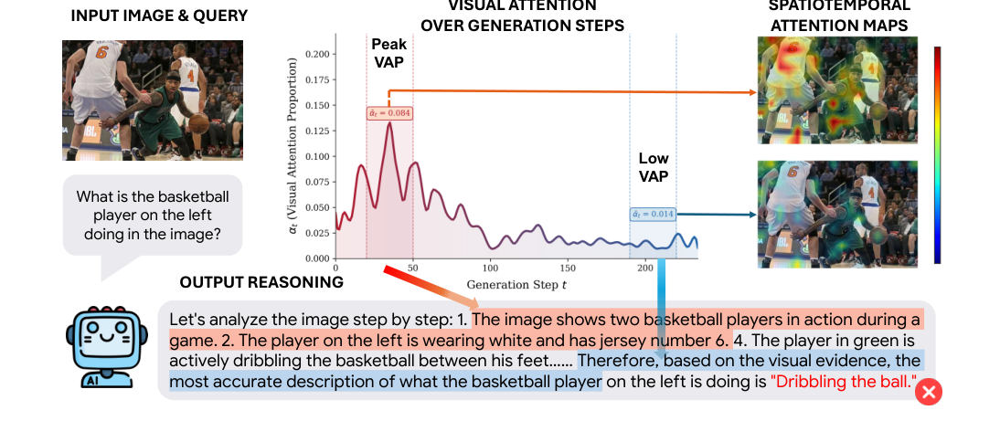
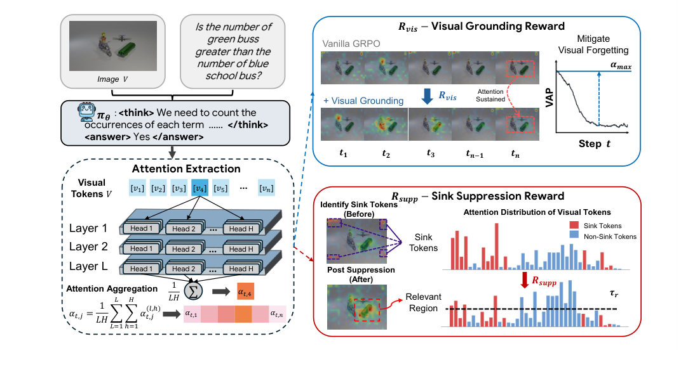

<div align="center">

# LASER: A Corrective Lens for LVLMs via Visual Attention Preservation and Sink Suppression

### ECCV 2026

[](https://arxiv.org/abs/XXXX.XXXXX)
[](https://github.com/<user>/LASER)
[](LICENSE)

</div>

LASER is a GRPO post-training framework that mitigates **visual forgetting** in vision–language models by shaping *when* and *where* the model attends to visual evidence during long-horizon reasoning.

---

## 📰 News

- **[2026.xx]** 🎉 LASER is accepted to **ECCV 2026**.
- **[2026.06]** 🚀 Code and training scripts released.
- **[2026.xx]** 📄 arXiv preprint released. *(link coming soon)*

---

## 🔍 Overview

LVLMs reason well but progressively **drift away from the image** during long chains of thought. We trace this *visual forgetting* to two overlooked causes:

- **When (temporal):** decay that begins in **early decoding** is the most damaging — a single early-stage suppression drops MMStar accuracy 62.8% → 48.9%, while the same late intervention costs only ~2%. Early errors propagate autoregressively.
- **Where (distributional):** even when total visual attention is preserved, it **collapses onto a few task-irrelevant "sink" tokens** (2–3× the average per-token attention).

<p align="center">
  
</p>

**LASER** addresses both with two attention-derived rewards, added to the accuracy reward and **gated by answer correctness**:

- **Visual Grounding Reward (R<sub>vis</sub>)** — sustains attention on informative, *non-sink* visual tokens across decoding (with early-stage emphasis).
- **Sink Suppression Reward (R<sub>supp</sub>)** — penalizes attention concentration on visual *sink* tokens, redistributing it to meaningful regions.

<p align="center">
  
</p>

On 8 benchmarks (Qwen2.5-VL-7B base) LASER reaches a new best of **64.1 on MMStar**, **+3.3** on HallusionBench, and its largest margin on **MathVision (+12.7)**.

<details>
<summary>Full results table</summary>

| Model | MathVista | MathVerse | MathVision | WeMath | MMMU | MMStar | LogicVista | HallusionBench |
|---|:--:|:--:|:--:|:--:|:--:|:--:|:--:|:--:|
| Qwen2.5-VL-7B (base) | 66.7 | 40.7 | 26.4 | 33.1 | 52.7 | 54.9 | 42.6 | 53.6 |
| VisionR1-7B | 73.5 | 52.4 | 28.2 | 41.6 | 57.6 | 61.4 | 49.7 | 49.5 |
| R1-Onevision-7B | 64.1 | 46.4 | 29.9 | **44.6** | 54.3 | 54.1 | 45.6 | 52.5 |
| OpenVLThinker-7B | 72.3 | 50.3 | 25.9 | – | – | 61.9 | – | 52.2 |
| Reflection-V-7B | 73.3 | – | 33.9 | – | 61.3 | – | – | 53.9 |
| VAPO-Thinker-7B | 75.6 | 53.3 | 31.9 | 43.6 | 60.2 | 63.0 | 50.9 | 57.4 |
| **LASER (Ours)** | 72.9 | **55.2** | **44.6** | 44.4 | **62.1** | **64.1** | **51.2** | **60.7** |

</details>

---

## ⚙️ Getting Started

LASER is built on the [verl](https://github.com/volcengine/verl) RL framework and targets **Qwen2.5-VL** on CUDA 12.8 (PyTorch 2.8.0, vLLM 0.11.0).

**Option A — Container (recommended).** Use a vLLM 0.11.0 / CUDA 12.8 image (which already ships compiled `vllm`, `flashinfer`, and `flash-attn`), mount this repo, and install it:

```bash
git clone https://github.com/<user>/LASER.git
cd LASER
pip install -e .
```

**Option B — Your own environment.** Install PyTorch from the cu128 index, then the pinned dependencies:

```bash
pip install torch==2.8.0 torchvision==0.23.0 torchaudio==2.8.0 \
    --index-url https://download.pytorch.org/whl/cu128
pip install -r requirements_laser.txt
pip install -e .
```

> `transformers==4.57.6` is pinned on purpose — the hook-based attention capture mirrors Qwen2.5-VL's attention forward from that version. `vllm`, `flashinfer`, and `flash-attn` are compiled and are easiest to get from the container.

---

## 📦 Dataset

LASER trains on **~45K multimodal RL samples** curated from publicly available reasoning datasets (e.g., Revisual-R1).

Provide your data as **verl-format parquet files** — one row per sample with:
- an `images` column (the image or list of images),
- the prompt/question,
- the ground-truth answer (used by the accuracy reward).

Then point `TRAIN_FILES` / `VAL_FILES` in `train.sh` at them.

> 📥 *Processed training/validation parquet files: link coming soon.*

---

## 🚀 Training

Edit the paths at the top of [`train.sh`](train.sh) (or pass them as environment variables) and launch:

```bash
MODEL_PATH=/path/to/Qwen2.5-VL-7B-Instruct \
TRAIN_FILES=/path/to/train.parquet \
VAL_FILES=/path/to/val.parquet \
N_GPUS=4 INFER_TP=2 \
bash train.sh
```

The LASER rewards are toggled by these flags (all exposed in `train.sh`):

| Flag | Component |
|---|---|
| `+trainer.enable_attention` | master switch for the attention rewards |
| `+actor_rollout_ref.actor.apply_rectification` | identify visual **sink tokens** |
| `+actor_rollout_ref.actor.apply_early_weighted_stability` | **Visual Grounding Reward** (R<sub>vis</sub>) |
| `+actor_rollout_ref.actor.apply_sink_suppression` | **Sink Suppression Reward** (R<sub>supp</sub>) |
| `+actor_rollout_ref.actor.apply_hook_attention` | memory-efficient hook-based attention capture |
| `+trainer.attention_start_step` | step at which the attention rewards begin |

The LASER code lives mainly in `verl/models/transformers/qwen2_vl.py` and `verl/workers/actor/attention_capture.py` (attention capture), `verl/workers/actor/dp_actor.py` (R<sub>vis</sub> / R<sub>supp</sub> scoring), and `verl/utils/reward_score/openr1_verl.py` (combined reward).

**Evaluation.** Merge the FSDP checkpoint to HuggingFace format, then evaluate with [VLMEvalKit](https://github.com/open-compass/VLMEvalKit) (temperature 0.6, top-p 0.95):

```bash
python -m verl.model_merger merge --backend fsdp \
    --local_dir  <OUTPUT_DIR>/laser/<exp>/global_step_<N>/actor \
    --target_dir <OUTPUT_DIR>/laser/<exp>/merged_step_<N>
```

---

## 🙏 Acknowledgements

LASER is built on top of the [verl](https://github.com/volcengine/verl) reinforcement-learning framework. We thank the verl team and the authors of the datasets and baselines used in our experiments.

## 📖 Citation

```bibtex
@inproceedings{laser2026,
  title     = {LASER: A Corrective Lens for LVLMs via Visual Attention Preservation and Sink Suppression},
  author    = {<fill in author list>},
  booktitle = {European Conference on Computer Vision (ECCV)},
  year      = {2026}
}
```

## 📜 License

Released under the [Apache 2.0 License](LICENSE), inherited from the upstream verl framework.
