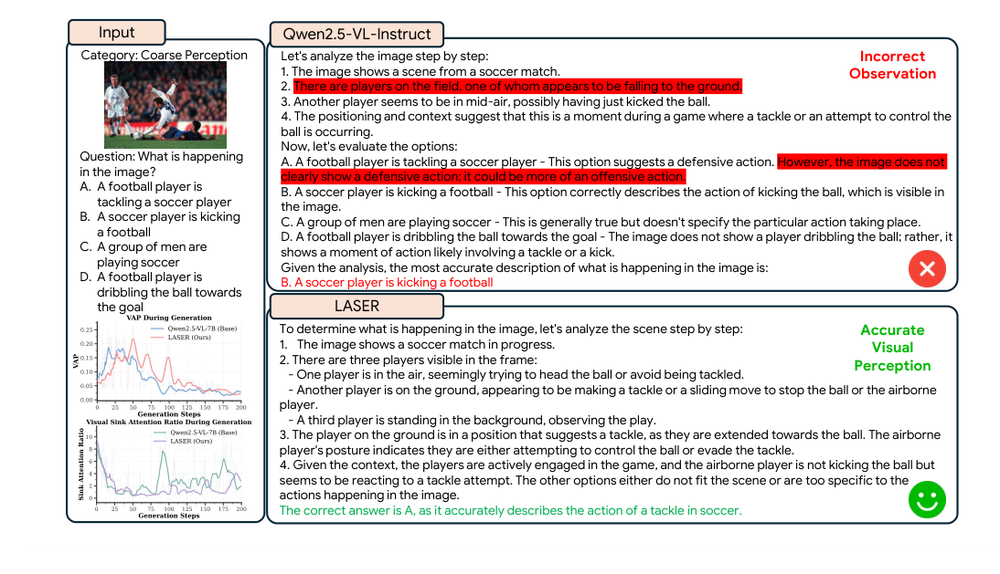

<div align="center">

# 🔎 LASER: A Corrective Lens for LVLMs via Visual Attention Preservation and Sink Suppression

**Mitigating *visual forgetting* in long-horizon multimodal reasoning by shaping *when* and *where* the model attends to visual evidence.**

<em>ECCV 2026</em>

</div>

<p align="center">
  
</p>
<p align="center"><em>
Overview of LASER. During GRPO rollouts, visual-token attention is extracted across decoding steps and turned
into two complementary rewards: <strong>R<sub>vis</sub></strong> sustains attention on informative (non-sink) visual
tokens, while <strong>R<sub>supp</sub></strong> identifies and suppresses task-irrelevant visual <em>sink</em> tokens.
</em></p>

---

## TL;DR

Large vision–language models (LVLMs) reason well but **drift away from the image during long chains of thought** — a phenomenon called **visual forgetting**. Through controlled interventions we find two overlooked causes:

1. ***When* (temporal):** decay that begins in **early decoding** is by far the most damaging — a single early-stage suppression drops MMStar accuracy from **62.8% → 48.9%**, while the same intervention late in decoding costs only ~2%. Early grounding errors propagate autoregressively.
2. ***Where* (distributional):** even when total visual attention is preserved, it **collapses onto a few task-irrelevant "sink" tokens** that absorb 2–3× the average per-token attention.

**LASER** is a GRPO post-training framework that fixes both with two attention-derived rewards (gated by answer correctness), and consistently outperforms strong baselines across 8 benchmarks — without longer outputs or test-time visual re-injection.

<p align="center">
  
</p>
<p align="center"><em>
Visual Attention Proportion (VAP) peaks early and decays over generation steps; later decoding attends less to
task-relevant regions.
</em></p>

---

## Method

LASER builds on **Group Relative Policy Optimization (GRPO)** and adds a two-component visual-attention reward, granted **only when the answer is correct** (a gate that prevents reward hacking):

$$R = R_{\text{acc}} + \omega \cdot \mathbf{1}_{[R_{\text{acc}} > 0]} \cdot \big(R_{\text{vis}} + R_{\text{supp}}\big)$$

- **Visual Grounding Reward — $R_{\text{vis}}$.** Computed over the **non-sink** visual tokens; rewards sustaining the per-step attention proportion close to its early peak (with an early-stage emphasis), preventing premature disengagement from visual evidence.
- **Sink Suppression Reward — $R_{\text{supp}}$.** Penalizes responses whose average per-token attention on **sink tokens** exceeds that of ordinary visual tokens, redistributing attention toward informative regions. Sink tokens are identified from massive-activation patterns in the hidden states.

The two rewards are complementary: $R_{\text{vis}}$ keeps visual evidence alive as a semantic scaffold, while $R_{\text{supp}}$ corrects *where* that preserved attention lands.

---

## Results

Reference model: **Qwen2.5-VL-7B-Instruct**. Evaluated with VLMEvalKit (temperature 0.6, top-p 0.95).

| Model | MathVista | MathVerse | MathVision | WeMath | MMMU | MMStar | LogicVista | HallusionBench |
|---|:--:|:--:|:--:|:--:|:--:|:--:|:--:|:--:|
| Qwen2.5-VL-7B (base) | 66.7 | 40.7 | 26.4 | 33.1 | 52.7 | 54.9 | 42.6 | 53.6 |
| VisionR1-7B | 73.5 | 52.4 | 28.2 | 41.6 | 57.6 | 61.4 | 49.7 | 49.5 |
| R1-Onevision-7B | 64.1 | 46.4 | 29.9 | **44.6** | 54.3 | 54.1 | 45.6 | 52.5 |
| OpenVLThinker-7B | 72.3 | 50.3 | 25.9 | – | – | 61.9 | – | 52.2 |
| Reflection-V-7B | 73.3 | – | 33.9 | – | 61.3 | – | – | 53.9 |
| VAPO-Thinker-7B | 75.6 | 53.3 | 31.9 | 43.6 | 60.2 | 63.0 | 50.9 | 57.4 |
| **LASER (Ours)** | 72.9 | **55.2** | **44.6** | 44.4 | **62.1** | **64.1** | **51.2** | **60.7** |

Highlights: a new best of **64.1 on MMStar**, **+3.3** on HallusionBench, and the largest margin on **MathVision (+12.7 over the closest competitor)**. Ablations confirm both rewards help: on Qwen2.5-VL-7B the average rises **51.1 (GRPO) → 52.2 (+R<sub>vis</sub>) → 53.7 (+R<sub>vis</sub>+R<sub>supp</sub>)**, and applied on a cold-start (Revisual-R1) base the average improves **52.2 → 58.0**.

<details>
<summary><strong>Qualitative example</strong> (click to expand)</summary>

<p align="center"></p>

The base model makes an early-stage grounding error that propagates to a wrong answer; LASER sustains visual attention and reasons to the correct one.
</details>

---

## Installation

LASER is implemented as a fork of the [**verl**](https://github.com/volcengine/verl) RL framework. The simplest path is to use a verl runtime image and install this repo in it:

```bash
git clone <this-repo-url> LASER
cd LASER

# Option A (recommended): use a verl Docker/Apptainer image (see docker/), then:
pip install -e .

# Option B: install into your own environment
pip install -e .            # plus the verl deps (torch, vLLM, flash-attn, transformers, ...)
```

Key components require a CUDA GPU environment with `vllm` and `flash-attn` available (the attention-capture path targets Qwen2.5-VL). See `requirements.txt` and `docker/` for the reference setup.

## Data

LASER trains on multimodal RL samples (≈45K in the paper, curated from publicly available reasoning datasets such as Revisual-R1). Provide your data as **verl-format parquet files** — one row per sample with an `images` column for the image(s), the prompt, and the ground-truth answer. Point `TRAIN_FILES` / `VAL_FILES` in `train.sh` at them.

## Training

Edit the paths at the top of [`train.sh`](train.sh) (or pass them as environment variables) and launch:

```bash
MODEL_PATH=/path/to/Qwen2.5-VL-7B-Instruct \
TRAIN_FILES=/path/to/train.parquet \
VAL_FILES=/path/to/val.parquet \
N_GPUS=4 INFER_TP=2 \
bash train.sh
```

The LASER rewards are controlled by these flags (all exposed in `train.sh`):

| Flag | Paper component |
|---|---|
| `+trainer.enable_attention` | master switch for the attention rewards |
| `+actor_rollout_ref.actor.apply_rectification` | identify visual **sink tokens** |
| `+actor_rollout_ref.actor.apply_early_weighted_stability` | **Visual Grounding Reward** $R_{\text{vis}}$ (early-weighted) |
| `+actor_rollout_ref.actor.apply_sink_suppression` | **Sink Suppression Reward** $R_{\text{supp}}$ |
| `+actor_rollout_ref.actor.apply_hook_attention` | memory-efficient hook-based attention capture |
| `+trainer.attention_start_step` | step at which the attention rewards begin |

The reward-mixing weight $\omega$ and the per-reward scales live in [`verl/utils/reward_score/openr1_verl.py`](verl/utils/reward_score/openr1_verl.py) (`ATTENTION_SCORE_WEIGHT`, `SUPPRESSION_SCORE_WEIGHT`, `FORMAT_REWARD_WEIGHT`) and [`verl/workers/config/actor.py`](verl/workers/config/actor.py) (`stability_reward_*`, `suppression_reward_*`).

## Evaluation

Benchmark results in the paper use [VLMEvalKit](https://github.com/open-compass/VLMEvalKit) with temperature 0.6 / top-p 0.95. Merge the trained FSDP checkpoint to a HuggingFace model first:

```bash
python -m verl.model_merger merge --backend fsdp \
    --local_dir  <OUTPUT_DIR>/laser/<exp>/global_step_<N>/actor \
    --target_dir <OUTPUT_DIR>/laser/<exp>/merged_step_<N>
```

then evaluate the merged model with VLMEvalKit on the 8 benchmarks (MathVista, MathVerse, MathVision, WeMath, MMMU, MMStar, LogicVista, HallusionBench).

## Where the LASER code lives

This repository is a large framework; the LASER-specific additions are concentrated in:

| Paper component | File(s) |
|---|---|
| Visual attention extraction $\alpha_{t,j}$ | `verl/models/transformers/qwen2_vl.py` (`get_full_attention`, patched forwards), `verl/models/transformers/monkey_patch.py`, `verl/workers/actor/attention_capture.py` (hook-based capture) |
| Sink-token identification + scoring | `verl/workers/actor/dp_actor.py` (`generate_attentions_experimental[_hooked]`, `compute_windowed_global_stability[_early_weighted]`, `compute_sink_suppression_reward`) |
| Reward orchestration during training | `verl/workers/fsdp_workers.py` (`compute_attentions`), `verl/trainer/ppo/ray_trainer.py` |
| Combined reward $R$ (Eq. 8) | `verl/utils/reward_score/openr1_verl.py` (`compute_score_vanilla`), `verl/utils/reward_score/acc_reward.py` |
| Reward weights / switches | `verl/workers/config/actor.py` |
| Training entry point | `train.sh` |

## Citation

If you find LASER useful, please cite:

```bibtex
@inproceedings{laser2026,
  title     = {LASER: A Corrective Lens for LVLMs via Visual Attention Preservation and Sink Suppression},
  author    = {<fill in author list>},
  booktitle = {European Conference on Computer Vision (ECCV)},
  year      = {2026}
}
```

## Acknowledgements

LASER is built on top of the [verl](https://github.com/volcengine/verl) reinforcement-learning framework. We thank the verl team and the authors of the datasets and baselines used in our experiments.

## License

This project inherits the [Apache 2.0 License](LICENSE) of the upstream verl framework.
